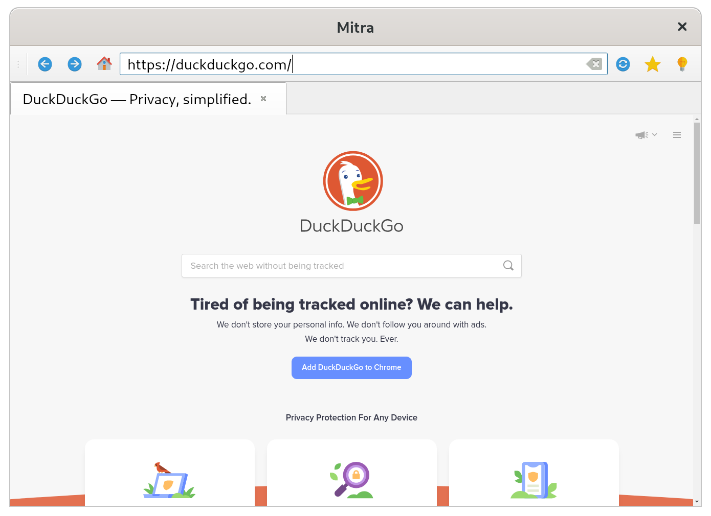
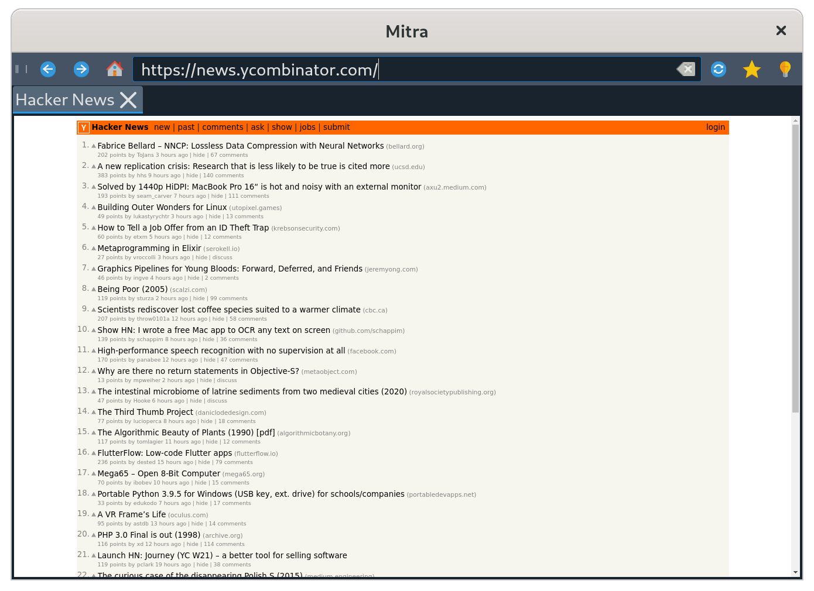

# Mitra


Mitra is a minimalist and open-source web browser written in PyQt5 using Python programming language. It has various features including: tabs, bookmarks and dark mode.

## Name

If you're interested in the origins of the name chosen for this project, please visit these links: [[1]](https://www.britannica.com/topic/Mithra) [[2]](https://en.wikipedia.org/wiki/Mithra)

## Usage

To run this browser on your machine, launch a terminal and run this command:

```
python mitra.py
```

## Screenshots





## Requirements

To install requirements for this project, open up a terminal window and run this command:

```
pip install -r requirements.txt	
```

## Credits

The icons used in this project were created by  Arnaud Chesne (@paomedia). 
